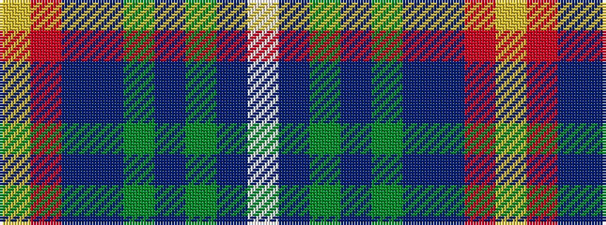

WBGBGBBRY

It is a 9 stripe tartan.

<figure class="pat-woven">

<figcaption>idealised sample</figcaption>
</figure>

## Colour Sequence



## Tartans with this colour sequence

| Tartans |
|---------------|
| [McLion (Corporate)](/setts/s9/w1dbi6g1dbi1g1dbi1db4r5lo1~x4/)|
||
