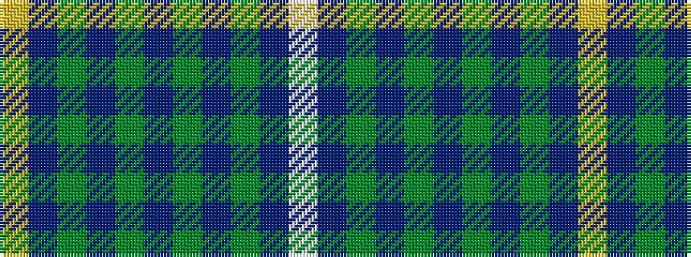

WBGBGBGBGBY

It is a 11 stripe tartan.

<figure class="pat-woven">

<figcaption>idealised sample</figcaption>
</figure>

## Colour Sequence



## Tartans with this colour sequence

| Tartans |
|---------------|
| [Bruce (Personal)](/variants/s11/w1db8g2db2g6db1g6db2g2db8ly1~x4/)|
||
| [Bute Heather, Glencallum (Fashion)](/variants/s11/ly13db2g38db13g8db8g17db2g17db4w11/)|
||
