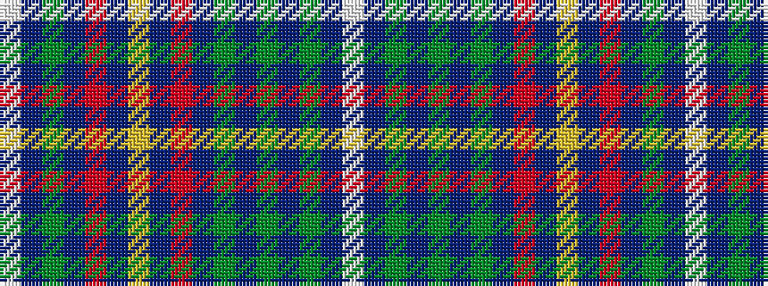

WBGBGBGBRBYBRBGBW

It is a 17 stripe tartan.

<figure class="pat-woven">

<figcaption>idealised sample</figcaption>
</figure>

## Colour Sequence



## Tartans with this colour sequence

| Tartans |
|---------------|
| [Alaskan Scottish](/variants/s17/w4t1dg9t9r9t1ly4t1r9t9dg1t1dg1t1dg4t1w4~x2/)|
||
| [Alaskan Scottish](/variants/s17/w4db1g9db9r9db1ly4db1r9db9g1db1g1db1g4db1w4~x2/)|
||
