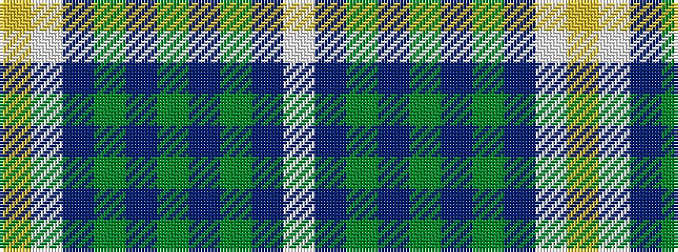

WBGBGBGBWY

It is a 10 stripe tartan.

<figure class="pat-woven">

<figcaption>idealised sample</figcaption>
</figure>

## Colour Sequence



## Tartans with this colour sequence

| Tartans |
|---------------|
| [Ballarat](/setts/s10/w5n38y3db11y1db11y3n4w5lo1~x2/)|
||
