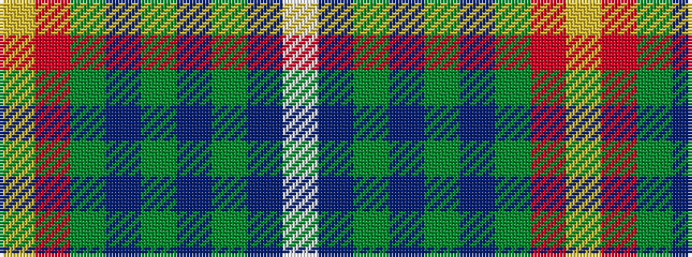

WBGBGBGRY

It is a 9 stripe tartan.

<figure class="pat-woven">

<figcaption>idealised sample</figcaption>
</figure>

## Colour Sequence



## Tartans with this colour sequence

| Tartans |
|---------------|
| [McLion](/variants/s9/w1db6g1db1g1db1gi4m5lo1~x4/)|
||
