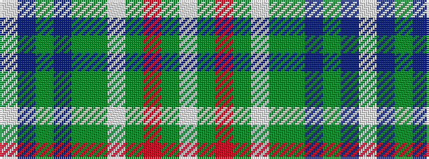

WBGBGGWGRGW

It is a 11 stripe tartan.

<figure class="pat-woven">

<figcaption>idealised sample</figcaption>
</figure>

## Colour Sequence



## Tartans with this colour sequence

| Tartans |
|---------------|
| [Strathyre Dress (Dance)](/setts/s11/w36g6r2g3w2g3dy6p4g2p2w2~x2/)|
||
