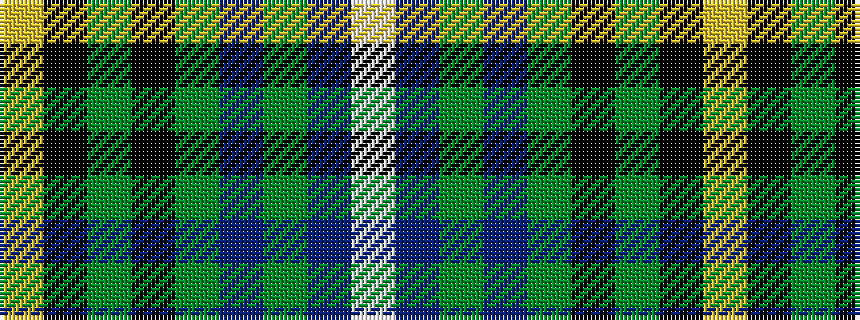

WBGBGKGKY

It is a 9 stripe tartan.

<figure class="pat-woven">

<figcaption>idealised sample</figcaption>
</figure>

## Colour Sequence



## Tartans with this colour sequence

| Tartans |
|---------------|
| [Henderson](/setts/s9/ly1k6dg4k1dg16db1dg4db6lb1~x2/)|
||
| [Henderson/MacKendrick](/setts/s9/w1db6g4db1g16k1g4k6ly1~x4/)|
||
| [MacKendrick](/setts/s9/w1db6g4db1g16k1g4k6ly1~x2/)|
||
