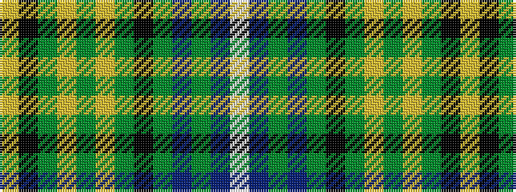

WBGBGKGYGYGKY

It is a 13 stripe tartan.

<figure class="pat-woven">

<figcaption>idealised sample</figcaption>
</figure>

## Colour Sequence



## Tartans with this colour sequence

| Tartans |
|---------------|
| [O'Doherty (Glasgow) (Personal)](/setts/s13/w2db10g3db2g3k18g10ly1g3ly2g2k2ly2~x2/)|
||
| [O'Doherty (Name)](/setts/s13/w2dt10dg3dt2dg3k18dg10ly1dg3ly2dg2k2ly2~x2/)|
||
