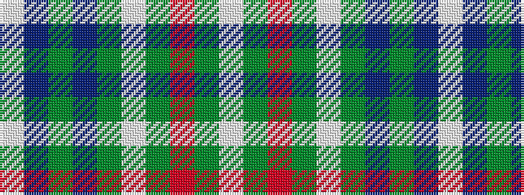

WBGBGWGRGW

It is a 10 stripe tartan.

<figure class="pat-woven">

<figcaption>idealised sample</figcaption>
</figure>

## Colour Sequence



## Tartans with this colour sequence

| Tartans |
|---------------|
| [Strathyre Dress (Dance)](/setts/s10/w55dg12r2dg3w2g10dp9dg2dp6w2~x2/)|
||
