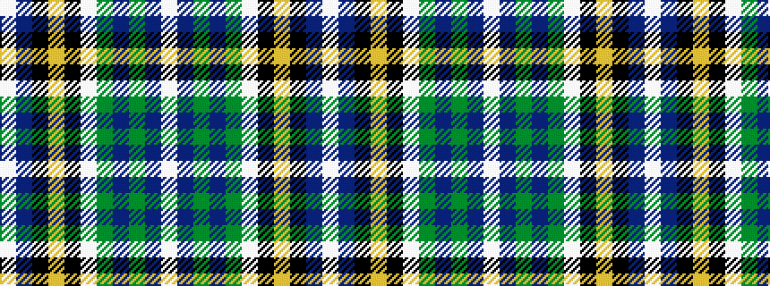

WBGBGWKYKBW

It is a 11 stripe tartan.

<figure class="pat-woven">

<figcaption>idealised sample</figcaption>
</figure>

## Colour Sequence



## Tartans with this colour sequence

| Tartans |
|---------------|
| [Pritchard](/variants/s11/w24db2k2ly1k1w1g6n4g1n1w1~x4/)|
||
