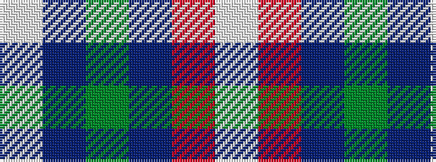

WBGBRW

It is a 6 stripe tartan.

<figure class="pat-woven">

<figcaption>idealised sample</figcaption>
</figure>

## Colour Sequence



## Tartans with this colour sequence

| Tartans |
|---------------|
| [The Open Championship](/setts/s6/w2db15y2dbi20r9w2~x2/)|
||
