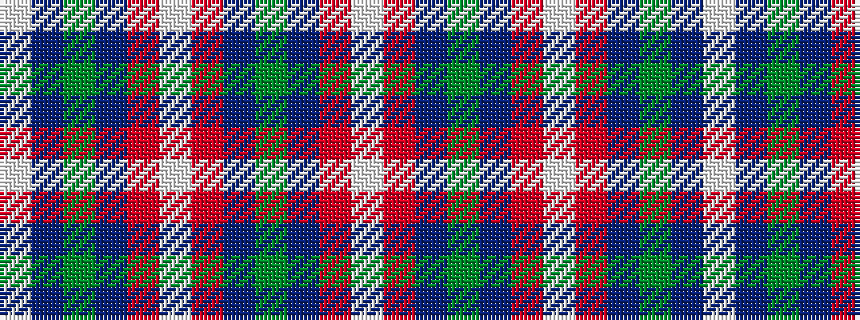

WBGBRWRBGBRW

It is a 12 stripe tartan.

<figure class="pat-woven">

<figcaption>idealised sample</figcaption>
</figure>

## Colour Sequence



## Tartans with this colour sequence

| Tartans |
|---------------|
| [Yamaue (Corporate)](/variants/s12/w2r5db4g8db4r5w2r5db40g8db4w2~x2/)|
||
