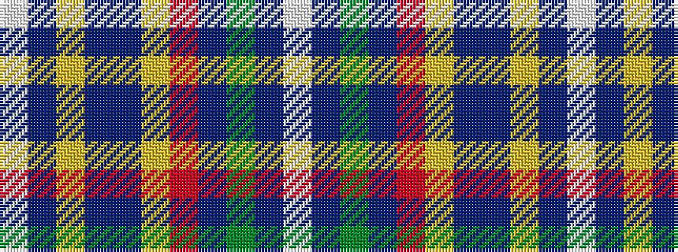

WBGBRYBBYBW

It is a 11 stripe tartan.

<figure class="pat-woven">

<figcaption>idealised sample</figcaption>
</figure>

## Colour Sequence



## Tartans with this colour sequence

| Tartans |
|---------------|
| [Wee Course, Blairgowrie Golf Club, The](/setts/s11/w3n30dg3db3r3lo3db8n3lo3db3w3~x2/)|
||
