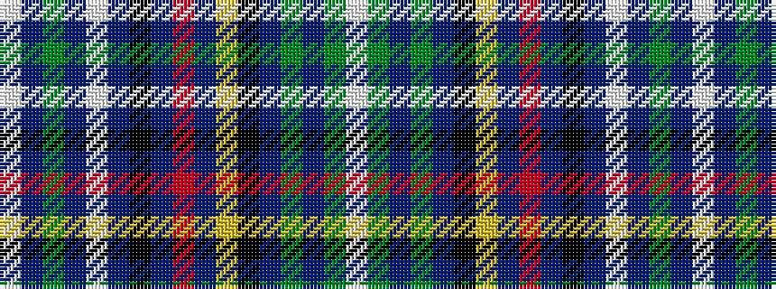

WBGBWBKBRBYKBGBGW

It is a 17 stripe tartan.

<figure class="pat-woven">

<figcaption>idealised sample</figcaption>
</figure>

## Colour Sequence



## Tartans with this colour sequence

| Tartans |
|---------------|
| [Kumikyoku - Tone of Forest](/setts/s17/w5db3g12db3lb5db3k13db3r5db3ly2k11db3g5db3g25w2/)|
||
