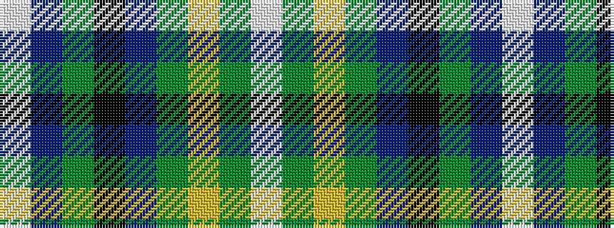

WBGKBGYGW

It is a 9 stripe tartan.

<figure class="pat-woven">

<figcaption>idealised sample</figcaption>
</figure>

## Colour Sequence



## Tartans with this colour sequence

| Tartans |
|---------------|
| [Armagh County Crest (Fashion)](/setts/s9/w3db4dg8k5db20g3ly13g4w2~x2/)|
||
