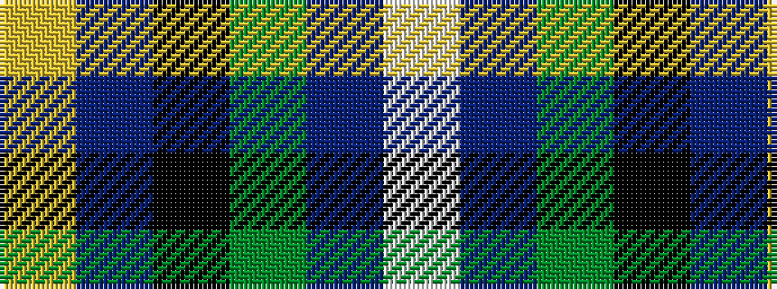

WBGKBY

It is a 6 stripe tartan.

<figure class="pat-woven">

<figcaption>idealised sample</figcaption>
</figure>

## Colour Sequence



## Tartans with this colour sequence

| Tartans |
|---------------|
| [Ancient Atlantic](/setts/s6/w1db6dy5k1db6ly1~x4/)|
||
| [Baptist Union of Scotland](/setts/s6/lo4db23k4g16db23lb4/)|
||
