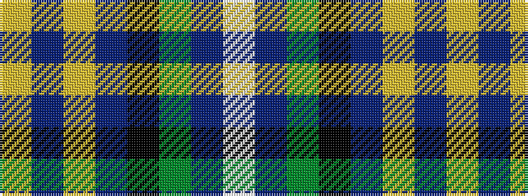

WBGKBYBY

It is a 8 stripe tartan.

<figure class="pat-woven">

<figcaption>idealised sample</figcaption>
</figure>

## Colour Sequence



## Tartans with this colour sequence

| Tartans |
|---------------|
| [Lambert, Patrice (Personal)](/variants/s8/w1p3g6k1db12ly1db2ly1~x4/)|
||
| [Lambert, Patrice (Personal)](/variants/s8/w1dp3g6k1db12ly1db2ly1~x4/)|
||
