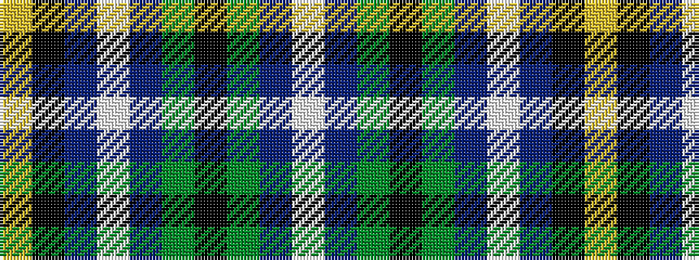

WBGKGBWBKY

It is a 10 stripe tartan.

<figure class="pat-woven">

<figcaption>idealised sample</figcaption>
</figure>

## Colour Sequence



## Tartans with this colour sequence

| Tartans |
|---------------|
| [Hawes (2014)](/setts/s10/w2do3g5k50g4do3w2t3k2ly2~x2/)|
||
| [Hawes (Personal)](/setts/s10/w2dr3g5k50g4dr3w2t3k2lo2~x2/)|
||
| [Hawks (2014)](/setts/s10/w2do3g5k50g4do3w2db3k2ly2~x2/)|
||
