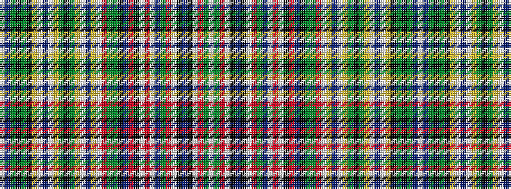

WBGKGKYWBWYGKGYWBYWRGGKBRKWRWBGRWKBKWRGW

It is a 40 stripe tartan.

<figure class="pat-woven">

<figcaption>idealised sample</figcaption>
</figure>

## Colour Sequence



## Tartans with this colour sequence

| Tartans |
|---------------|
| [Valencia](/variants/s40/w4db16dg8k8dg48k8ly4w6t7w6ly4dg12k8dg12ly36w6t7ly4w2r8dg16g64k8db8r48k22w2r8w2db16dg18r4w2k2t7k2w6r4dg36w2/)|
||
