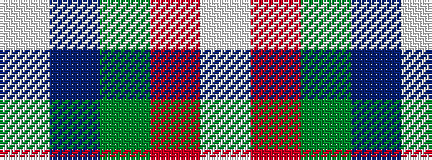

WBGRW

It is a 5 stripe tartan.

<figure class="pat-woven">

<figcaption>idealised sample</figcaption>
</figure>

## Colour Sequence



## Tartans with this colour sequence

| Tartans |
|---------------|
| [Highland Spring Dress (2004) (Corp)](/variants/s5/w4db30g10r25w2~x2/)|
||
