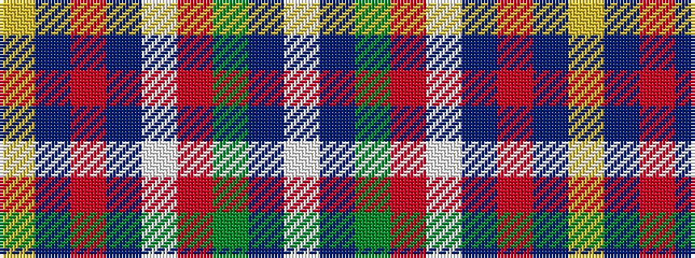

WBGRWBRBY

It is a 9 stripe tartan.

<figure class="pat-woven">

<figcaption>idealised sample</figcaption>
</figure>

## Colour Sequence



## Tartans with this colour sequence

| Tartans |
|---------------|
| [Scotia](/variants/s9/w4db58g28o4w18db14r3db8ly4/)|
||
