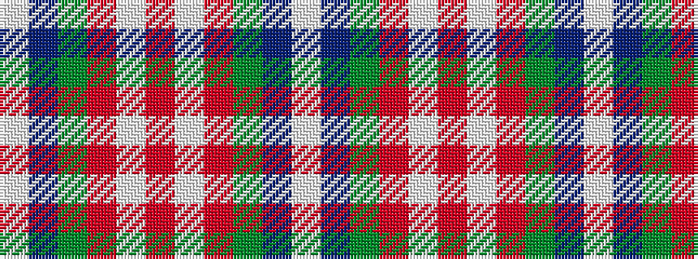

WBGRWRWRGBW

It is a 11 stripe tartan.

<figure class="pat-woven">

<figcaption>idealised sample</figcaption>
</figure>

## Colour Sequence



## Tartans with this colour sequence

| Tartans |
|---------------|
| [Stuart/Stewart Riding Cloak](/setts/s11/w1db4dy8r4w1r4w1r4dg16db2w1~x2/)|
||
