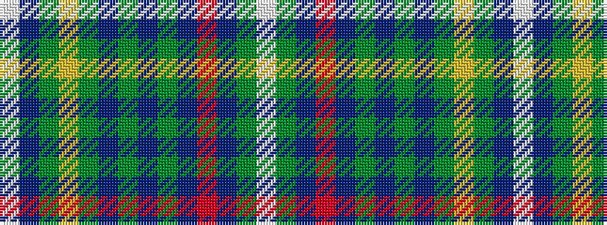

WBGYGBGBGBRBGW

It is a 14 stripe tartan.

<figure class="pat-woven">

<figcaption>idealised sample</figcaption>
</figure>

## Colour Sequence



## Tartans with this colour sequence

| Tartans |
|---------------|
| [Scottish Bakers](/setts/s14/w2dp2y3ly5y13dp2y2dp2y2dp33m2dp1y4w1~x2/)|
||
