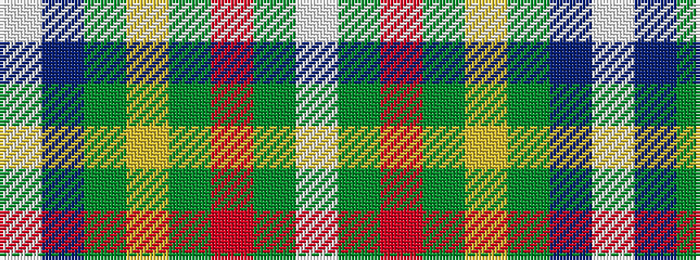

WBGYGRGW

It is a 8 stripe tartan.

<figure class="pat-woven">

<figcaption>idealised sample</figcaption>
</figure>

## Colour Sequence



## Tartans with this colour sequence

| Tartans |
|---------------|
| [Tartan Day SA (Corporate)](/setts/s8/w2db40g22ly3g2r3g2w2~x2/)|
||
