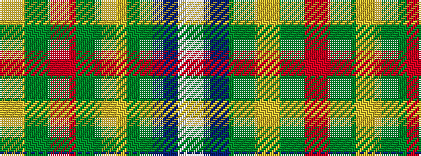

WBGYGRGY

It is a 8 stripe tartan.

<figure class="pat-woven">

<figcaption>idealised sample</figcaption>
</figure>

## Colour Sequence



## Tartans with this colour sequence

| Tartans |
|---------------|
| [Yes Scotland](/setts/s8/lr12dg4m4dg4lr31y3b12w4~x2/)|
||
