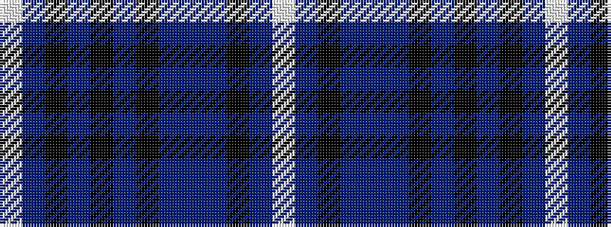

WBKBBBKBKBKBW

It is a 13 stripe tartan.

<figure class="pat-woven">

<figcaption>idealised sample</figcaption>
</figure>

## Colour Sequence



## Tartans with this colour sequence

| Tartans |
|---------------|
| [Edgar (2014)](/variants/s13/w1db16k12t2dp3t2k12db2k2db2k2db7w1~x2/)|
||
