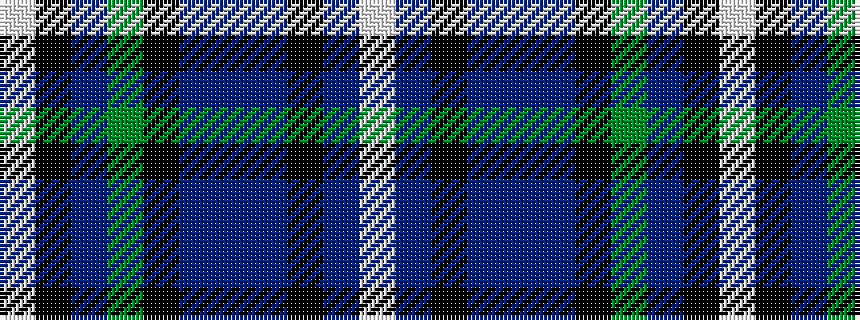

WBKBBBKGBKW

It is a 11 stripe tartan.

<figure class="pat-woven">

<figcaption>idealised sample</figcaption>
</figure>

## Colour Sequence



## Tartans with this colour sequence

| Tartans |
|---------------|
| [Utah State University](/variants/s11/w7b10k7b7t7b45k21g21t4k4w7~x2/)|
||
| [Utah State University](/variants/s11/lb7db10k7db7t7db45k21g21t4k4lb7~x2/)|
||
