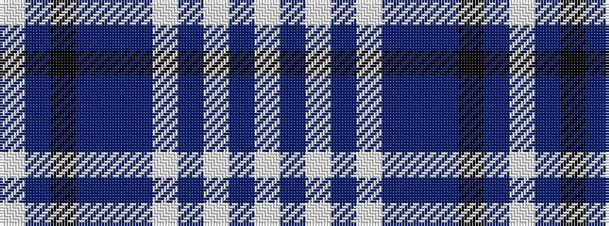

WBKBBBWBWBW

It is a 11 stripe tartan.

<figure class="pat-woven">

<figcaption>idealised sample</figcaption>
</figure>

## Colour Sequence



## Tartans with this colour sequence

| Tartans |
|---------------|
| [Bennet Dress (Fashion)](/variants/s11/w64db18lb2db3w2db3n14b8k2b4w2~x2/)|
||
