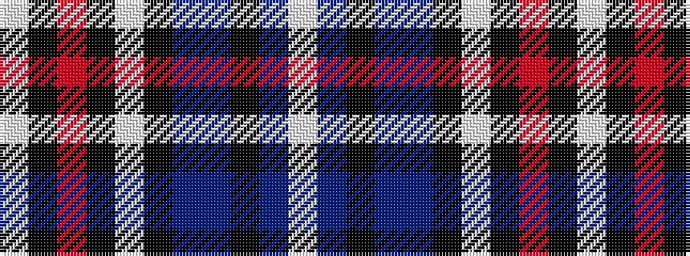

WBKBBKWKRKW

It is a 11 stripe tartan.

<figure class="pat-woven">

<figcaption>idealised sample</figcaption>
</figure>

## Colour Sequence



## Tartans with this colour sequence

| Tartans |
|---------------|
| [Stewart Dress, Grey #1 (Fashion)](/setts/s11/lb52k12r3k3lb3k3do10n8k3n3lb3~x2/)|
||
