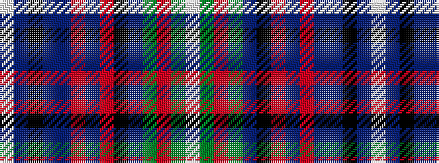

WBKBBRBRKBGRGW

It is a 14 stripe tartan.

<figure class="pat-woven">

<figcaption>idealised sample</figcaption>
</figure>

## Colour Sequence



## Tartans with this colour sequence

| Tartans |
|---------------|
| [Aberfeldy](/variants/s14/w2n2k2t2n32r2n2r2k13n2g16r2g2w2~x2/)|
||
