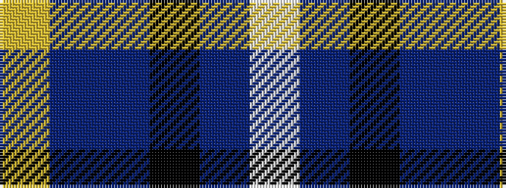

WBKBBY

It is a 6 stripe tartan.

<figure class="pat-woven">

<figcaption>idealised sample</figcaption>
</figure>

## Colour Sequence



## Tartans with this colour sequence

| Tartans |
|---------------|
| [Pipers' Trail (Corporate)](/variants/s6/lo4b8dp4k53db54w2/)|
||
| [Pipers' Trail, The](/variants/s6/w4dt54k53dp4b8lo4/)|
||
| [Pipers' Trail, The](/variants/s6/w4db54k53dp4t8ly4/)|
||
