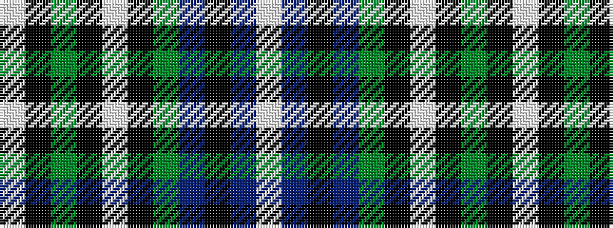

WBKBGKWKGKW

It is a 11 stripe tartan.

<figure class="pat-woven">

<figcaption>idealised sample</figcaption>
</figure>

## Colour Sequence



## Tartans with this colour sequence

| Tartans |
|---------------|
| [Grotto Dove](/variants/s11/lb26k7y1k1lb1k1y5dp3k1dp2lb1~x4/)|
||
