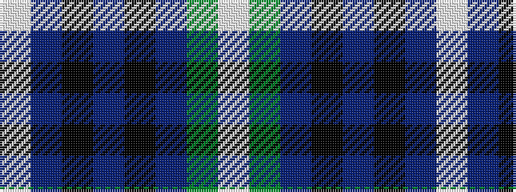

WBKBKBGW

It is a 8 stripe tartan.

<figure class="pat-woven">

<figcaption>idealised sample</figcaption>
</figure>

## Colour Sequence



## Tartans with this colour sequence

| Tartans |
|---------------|
| [Kelvinside Academy (School)](/variants/s8/w4y15db8k4db28k2db4w2/)|
||
