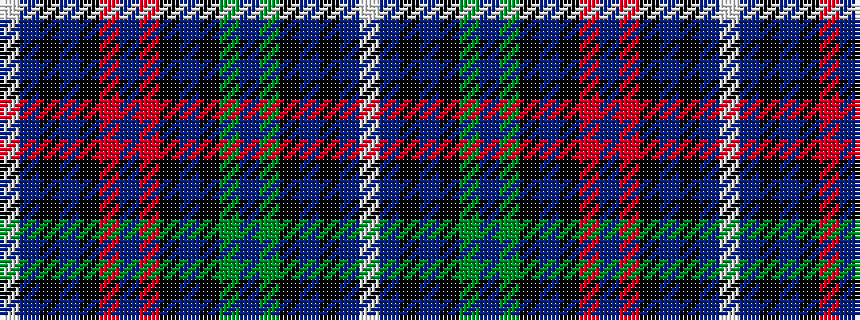

WBKBKGBGKBKRBRKBKBW

It is a 19 stripe tartan.

<figure class="pat-woven">

<figcaption>idealised sample</figcaption>
</figure>

## Colour Sequence



## Tartans with this colour sequence

| Tartans |
|---------------|
| [Caribou (District)](/variants/s19/w1dr4k1t3k1o4db1o4k1t3k1g4t1g4k1t3k1dr4w1~x4/)|
||
