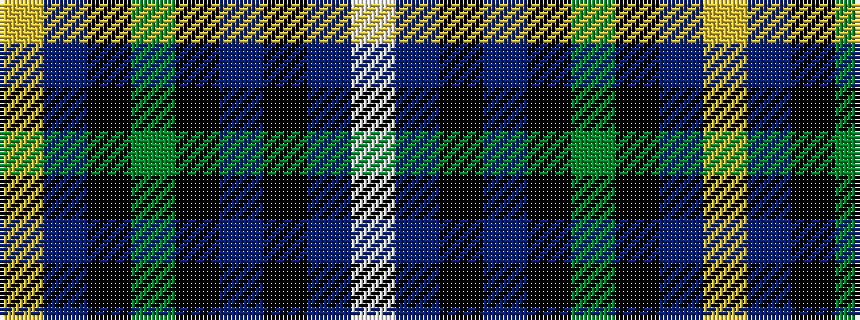

WBKBKGKBY

It is a 9 stripe tartan.

<figure class="pat-woven">

<figcaption>idealised sample</figcaption>
</figure>

## Colour Sequence



## Tartans with this colour sequence

| Tartans |
|---------------|
| [Bro-Kerne](/setts/s9/w3dt1k14dt2k1g6k1dt30lo3~x2/)|
||
