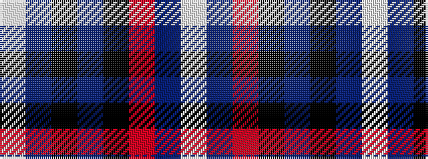

WBKBKRBW

It is a 8 stripe tartan.

<figure class="pat-woven">

<figcaption>idealised sample</figcaption>
</figure>

## Colour Sequence



## Tartans with this colour sequence

| Tartans |
|---------------|
| [Clinton (Personal)](/variants/s8/w5db6r18k8b5k4db27w3~x2/)|
||
