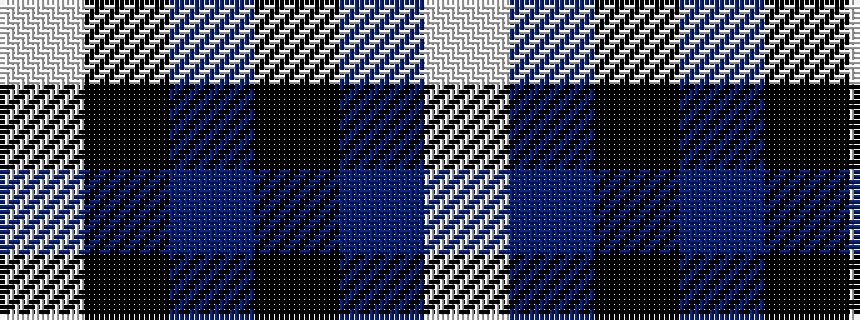

WBKBKW

It is a 6 stripe tartan.

<figure class="pat-woven">

<figcaption>idealised sample</figcaption>
</figure>

## Colour Sequence



## Tartans with this colour sequence

| Tartans |
|---------------|
| [Indian Pipe Band (Corporate)](/setts/s6/w4k26t26k2t5w2~x2/)|
||
