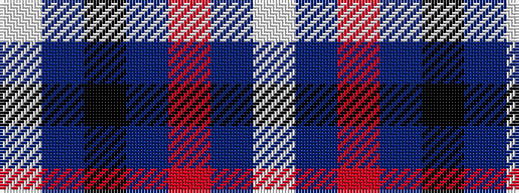

WBKBRBW

It is a 7 stripe tartan.

<figure class="pat-woven">

<figcaption>idealised sample</figcaption>
</figure>

## Colour Sequence



## Tartans with this colour sequence

| Tartans |
|---------------|
| [Central Newcastle School](/variants/s7/lp10dp9o59dp9k59dp9lp5/)|
||
