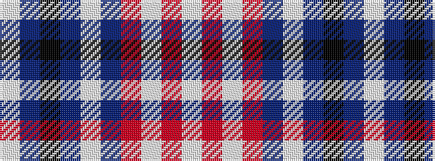

WBKBWBRWRW

It is a 10 stripe tartan.

<figure class="pat-woven">

<figcaption>idealised sample</figcaption>
</figure>

## Colour Sequence



## Tartans with this colour sequence

| Tartans |
|---------------|
| [Harris, Royal Blue (Dance)](/setts/s10/w3db2k4db2w2db26r4w30r2w3~x2/)|
||
