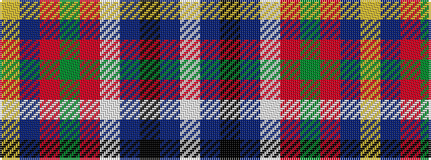

WBKBWRGRBY

It is a 10 stripe tartan.

<figure class="pat-woven">

<figcaption>idealised sample</figcaption>
</figure>

## Colour Sequence



## Tartans with this colour sequence

| Tartans |
|---------------|
| [University of Edinburgh Business School, The](/variants/s10/w2db6k3db3w3r4g4r4db25ly2~x2/)|
||
