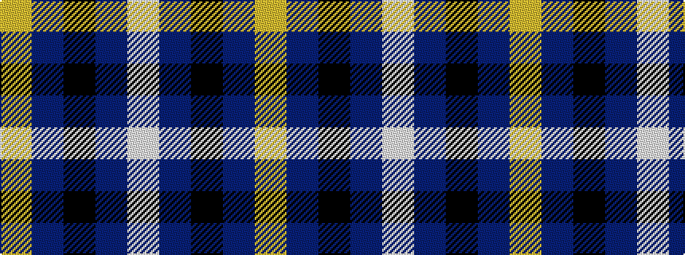

WBKBY

It is a 5 stripe tartan.

<figure class="pat-woven">

<figcaption>idealised sample</figcaption>
</figure>

## Colour Sequence



## Tartans with this colour sequence

| Tartans |
|---------------|
| [Bank of Scotland](/variants/s5/w4db30k23db24ly4~x2/)|
||
| [Bank of Scotland (1995)](/variants/s5/lo1db6k5db6lb1~x6/)|
||
