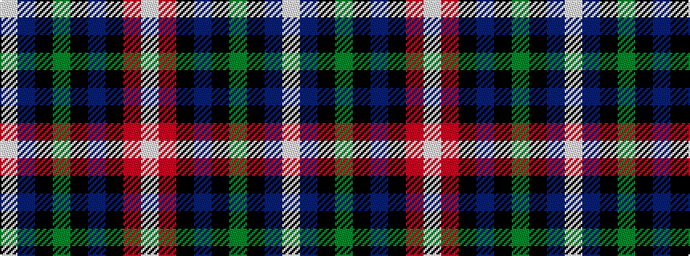

WBKGKBKRW

It is a 9 stripe tartan.

<figure class="pat-woven">

<figcaption>idealised sample</figcaption>
</figure>

## Colour Sequence



## Tartans with this colour sequence

| Tartans |
|---------------|
| [Scotland's Charity Air Ambulance](/variants/s9/w2b27k1g3k1n10k1r24w2~x2/)|
||
