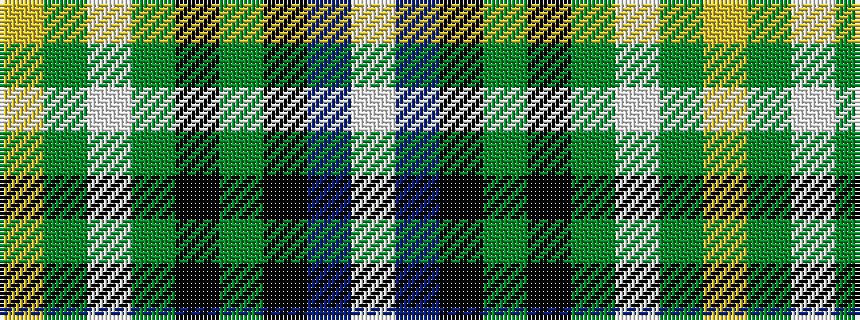

WBKGKGWGY

It is a 9 stripe tartan.

<figure class="pat-woven">

<figcaption>idealised sample</figcaption>
</figure>

## Colour Sequence



## Tartans with this colour sequence

| Tartans |
|---------------|
| [St. Andrews Golf Club (Corporate)](/variants/s9/w1db12k9g1k1g5lb1g3lo1~x4/)|
||
