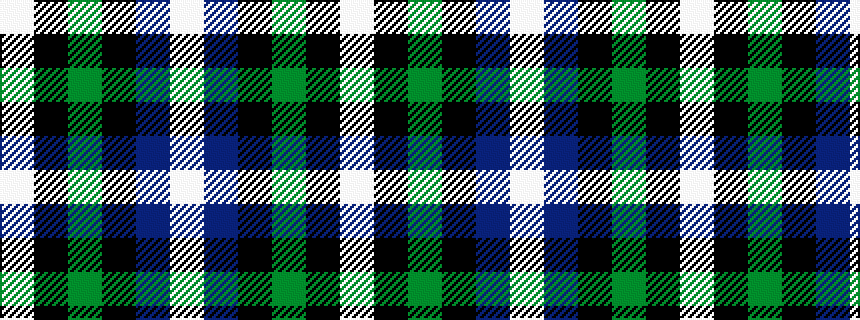

WBKGKW

It is a 6 stripe tartan.

<figure class="pat-woven">

<figcaption>idealised sample</figcaption>
</figure>

## Colour Sequence



## Tartans with this colour sequence

| Tartans |
|---------------|
| [MacNeil 1](/variants/s6/w1db9k9g9k2w1~x4/)|
||
| [MacNeil 2](/variants/s6/w2p10k10g9k3w2~x2/)|
||
