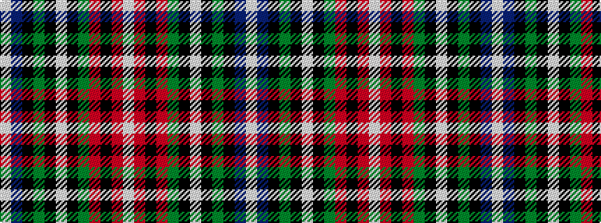

WBKGKWKGRKRW

It is a 12 stripe tartan.

<figure class="pat-woven">

<figcaption>idealised sample</figcaption>
</figure>

## Colour Sequence



## Tartans with this colour sequence

This pattern is a design lineage: every tartan below shares one colour order, whatever its owner —
near-identical designs are grouped, the largest lineage first (#112: the pattern is a tartan's
second parent, beside its family or clan).

<table class="sett-table">
<tbody>
<tr><td><a href="/variants/s12/w36db5k5y1k1w1k1g8r4k1r2w1/">Stewart Dress</a></td></tr>
<tr><td class="sett-swatch"></td></tr>
<tr><td><a href="/setts/w36db4k6y1k1w1k1g8r4k1r2w1/">Stewart Dress</a></td></tr>
<tr><td class="sett-swatch"></td></tr>
<tr><td><a href="/variants/s12/w39db3k6y3k3w3k3g8r5k3r3w3~x2/">Stewart Dress (Clan)</a></td></tr>
<tr><td class="sett-swatch"></td></tr>
<tr><td><a href="/variants/s12/w15db2k3y1k1w1k1g3r4k1r1w1~x2/">Stewart Dress MINI Tartan</a></td></tr>
<tr><td class="sett-swatch"></td></tr>
<tr><td><a href="/variants/s12/w31db4k6y2k2w2k2g7r4k2r2w2~x2/">Stuart/Stewart Dress Royal</a></td></tr>
<tr><td class="sett-swatch"></td></tr>
<tr class="cluster-sep"><td></td></tr>
<tr><td><a href="/variants/s12/lb29db3k10y2k2lb2k2g10r5k3r2lb2~x2/">Stewart Blue Trade Tartan</a></td></tr>
<tr><td class="sett-swatch"></td></tr>
<tr><td><a href="/variants/s12/lb57db4k8y4k4lb4k4g8r6k4r4lb2/">Stuart/Stewart Royal variant</a></td></tr>
<tr><td class="sett-swatch"></td></tr>
</tbody>
</table>

