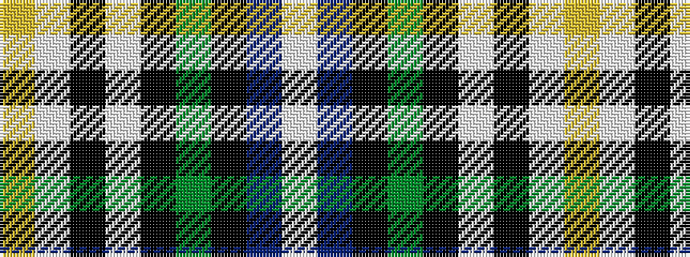

WBKGKWKWY

It is a 9 stripe tartan.

<figure class="pat-woven">

<figcaption>idealised sample</figcaption>
</figure>

## Colour Sequence



## Tartans with this colour sequence

| Tartans |
|---------------|
| [Hoban (Name)](/variants/s9/ly3lp9k3lp4k9g15k9db11w2~x4/)|
||
