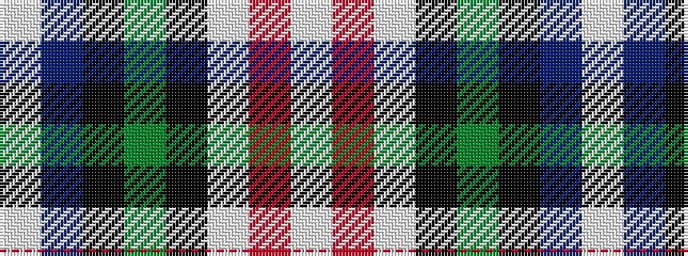

WBKGKWRW

It is a 8 stripe tartan.

<figure class="pat-woven">

<figcaption>idealised sample</figcaption>
</figure>

## Colour Sequence



## Tartans with this colour sequence

| Tartans |
|---------------|
| [Vinther, Niels Christian (Personal)](/setts/s8/lb3m14w1k2g2k16t20lb1~x2/)|
||
