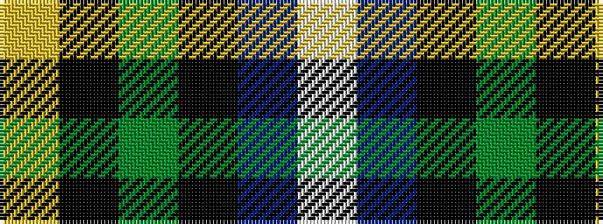

WBKGKY

It is a 6 stripe tartan.

<figure class="pat-woven">

<figcaption>idealised sample</figcaption>
</figure>

## Colour Sequence



## Tartans with this colour sequence

| Tartans |
|---------------|
| [MacNeil 4](/variants/s6/w1db8k9g9k1ly1~x4/)|
||
| [MacNeil 5](/variants/s6/w1db12k12g12k5ly1~x4/)|
||
| [MacNeil 6](/variants/s6/w3db14k12g12k2ly3~x2/)|
||
| [MacNeil 8](/variants/s6/w2p33k33g33k6ly2~x2/)|
||
| [MacNeil of Barra](/variants/s6/ly3k2dg12k12db14lb3/)|
||
| [MacNeil of Barra (Clan)](/variants/s6/w3b14k12g12k2ly3~x4/)|
||
