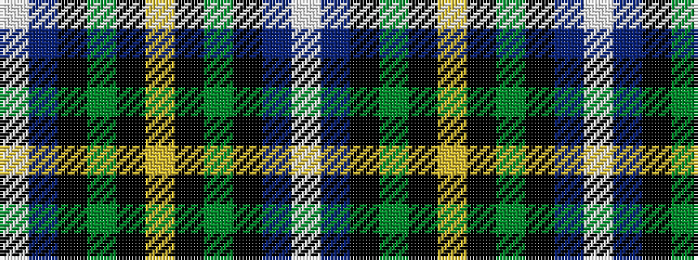

WBKGKYKGKBW

It is a 11 stripe tartan.

<figure class="pat-woven">

<figcaption>idealised sample</figcaption>
</figure>

## Colour Sequence



## Tartans with this colour sequence

| Tartans |
|---------------|
| [MacNeil](/setts/s11/w2db12k12g12k5ly1k5g12k12db12w1~x4/)|
||
