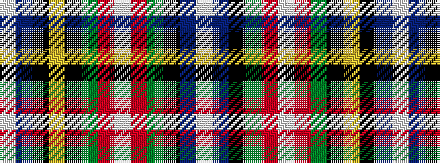

WBKGRWRGKYKBW

It is a 13 stripe tartan.

<figure class="pat-woven">

<figcaption>idealised sample</figcaption>
</figure>

## Colour Sequence



## Tartans with this colour sequence

| Tartans |
|---------------|
| [Nova Scotia Medical Examiner Service](/variants/s13/w2db2k32dg9r2w2r2dg4k20ly1k9db2w2~x2/)|
||
